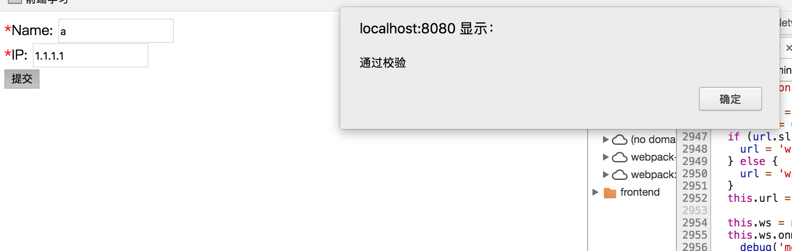
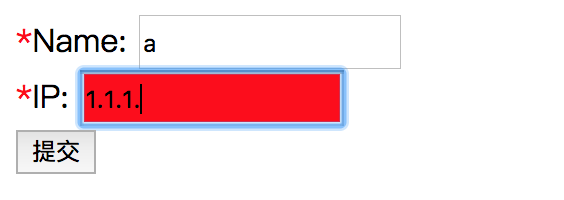

笔者近期在公司的项目中使用自定义指令完成了表单校验。
这里将思路分享给大家，并写了一个小demo。这个自定义指令还需要大家自行完善。

首先关于自定义指令的介绍可以参考[官网](https://cn.vuejs.org/v2/guide/custom-directive.html)。

首先，在github上已经有了一些开源组件可以支持表单校验。但是对于一些小项目而言，引入一个很大的东西实际上并不好。所以这里利用vue的自定义指令对表单校验进行了简单的实现。

#分析
在平时我们所见的表单中，常见的做法有2种：
 - input框输入时和提交时，立马进行校验；
 - 提交时，统一校验。

针对这2种实现，笔者分别进行了实现。分别如下。

##input框输入和提交时，进行校验
``` javascript
import Vue from 'vue'

const IP_REGEX = '^(1\\d{2}|2[0-4]\\d|25[0-5]|[1-9]\\d|[1-9])\\.' +
'(1\\d{2}|2[0-4]\\d|25[0-5]|[1-9]\\d|\\d)\\.' +
'(1\\d{2}|2[0-4]\\d|25[0-5]|[1-9]\\d|\\d)\\.' +
'(1\\d{2}|2[0-4]\\d|25[0-5]|[1-9]\\d|\\d)$'

// 注册一个全局自定义指令 `v-checkParam`
Vue.directive('checkParam', {
  // 当被绑定的元素插入到 DOM 中时……
  inserted: function (el, binding, vNode) {
    el.addEventListener('keyup', function (event) {
      // 首先去除已有样式
      el.className = el.className.replace('input-error', '').trim()
      // if (!event.keyCode) { // 加上这个判断就是在提交时，才会校验
        // 判断是否是否必填
      let isRequired = binding.value.required
      if (isRequired) {
        if (!el.value || el.value === '') {
          el.className += ' input-error'
        }
      }

        // 判断正则
        // debugger
      let regex = binding.value.regex
      if (regex === 'IpRegex') {
        if (!el.value.match(IP_REGEX)) {
          el.className += ' input-error'
        }
      } else if (!el.value.match(regex)) {
        el.className += ' input-error'
      }
      // }
    })
  }
})

// 注册一个全局自定义指令 `v-checkSubmit`
Vue.directive('checkSubmit', {
  // 当被绑定的元素插入到 DOM 中时……
  inserted: function (el, binding, vNode) {
    el.addEventListener('click', function (event) {
      let elements = document.getElementsByClassName('v-check')
      var evObj = document.createEvent('Event')
      evObj.initEvent('keyup', true, true)
      for (let element of elements) {
        element.dispatchEvent(evObj)
      }
      let errorInputs = document.getElementsByClassName('input-error');
      if(errorInputs.length === 0){
        vNode.context.submit();
      }
    })
  }
})
```

##提交时，再统一校验
``` javascript
import Vue from 'vue'

const IP_REGEX = '^(1\\d{2}|2[0-4]\\d|25[0-5]|[1-9]\\d|[1-9])\\.' +
'(1\\d{2}|2[0-4]\\d|25[0-5]|[1-9]\\d|\\d)\\.' +
'(1\\d{2}|2[0-4]\\d|25[0-5]|[1-9]\\d|\\d)\\.' +
'(1\\d{2}|2[0-4]\\d|25[0-5]|[1-9]\\d|\\d)$'

// 注册一个全局自定义指令 `v-checkParam`
Vue.directive('checkParam', {
  // 当被绑定的元素插入到 DOM 中时……
  inserted: function (el, binding, vNode) {
    el.addEventListener('keyup', function (event) {
      // 首先去除已有样式
      el.className = el.className.replace('input-error', '').trim()
      if (!event.keyCode) { // 加上这个判断就是在提交时，才会校验
        // 判断是否是否必填
        let isRequired = binding.value.required
        if (isRequired) {
          if (!el.value || el.value === '') {
            el.className += ' input-error'
          }
        }

        // 判断正则
        let regex = binding.value.regex
        if (regex === 'IpRegex') {
          if (!el.value.match(IP_REGEX)) {
            el.className += ' input-error'
          }
        }
        else if (!el.value.match(regex)) {
          el.className += ' input-error'
        }
      }
    })
  }
})

// 注册一个全局自定义指令 `v-checkSubmit`
Vue.directive('checkSubmit', {
  // 当被绑定的元素插入到 DOM 中时……
  inserted: function (el, binding, vNode) {
    el.addEventListener('click', function (event) {
      let elements = document.getElementsByClassName('v-check')
      var evObj = document.createEvent('Event')
      evObj.initEvent('keyup', true, true)
      for (let element of elements) {
        element.dispatchEvent(evObj)
      }
      let errorInputs = document.getElementsByClassName('input-error');
      if(errorInputs.length === 0){
        vNode.context.submit();
      }
    })
  }
})
```


## 区别
其实大家很容易发现，上面的2种实现只有一个if的区别，这个的含义是：由提交按钮触发的keyup,是没有keycode的，所以在if(!event.keyCode)满足时，进行校验（也就是在仅提交时，进行校验）。

## 用法说明
下面给出用例。

``` javascript
<template>
  <div>
   <div>
    <label class="star">Name:</label>
     <input class='v-check' v-checkParam="{required:true,regex:'^[abcde]*$'}" type="text">
   </div>
   <div>
    <label class="star">IP:</label>
     <input class='v-check' v-checkParam="{required:true,regex:'IpRegex'}"
     type="text">
     </div>
    <div>
      <button v-checkSubmit>提交</button>
    </div>
  </div>
</template>
<script>
export default {
  name: 'demo',
  methods: {
    submit () {
     alert('通过校验')
    }
  }
}
</script>

<style scoped>
input{
	height: 22px;
}
.input-error{
 background-color: red;
}
.star:before
{
  content:"*";
  color:red;
}
</style>
```

所有绑定了class="v-check"的input，都会在v-checkSubmit被click时进行校验，而其校验规则是v-checkParam对应的规则。

全部校验通过后，会回调到submit方法。进行触发接下来的事务。

## 效果截图



